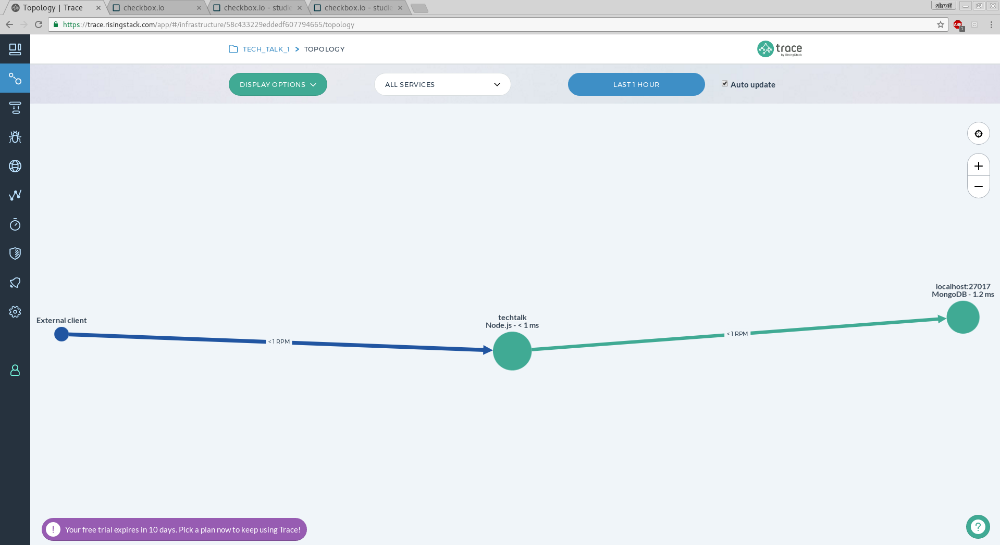
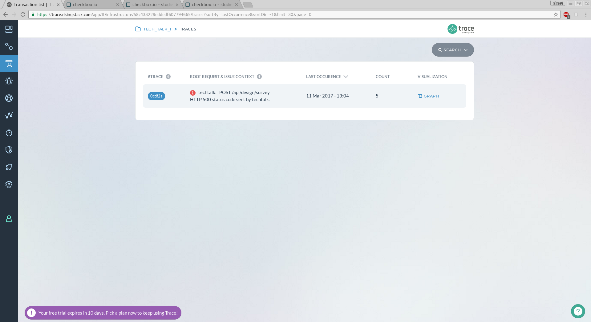
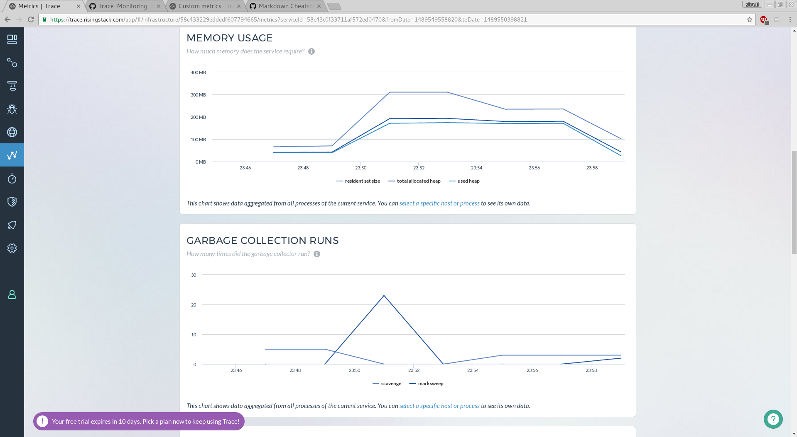
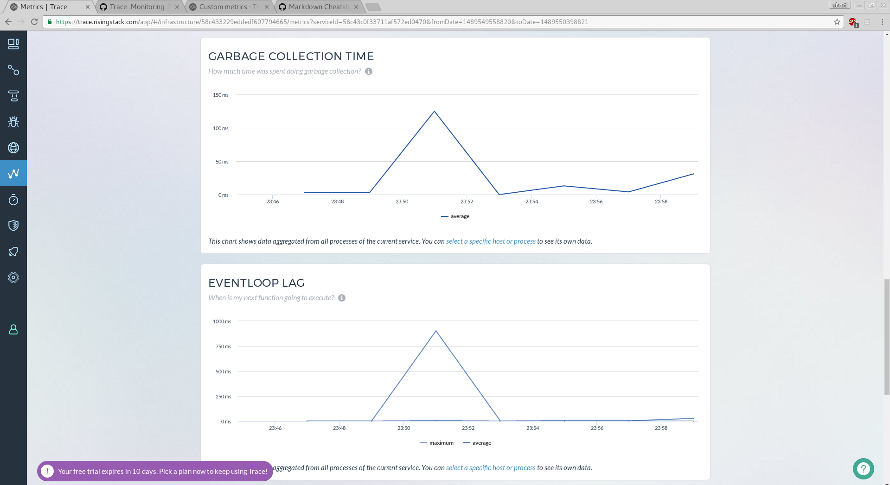
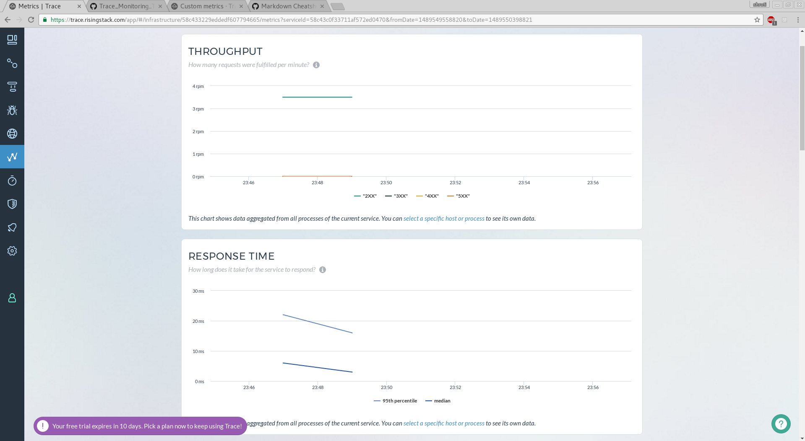
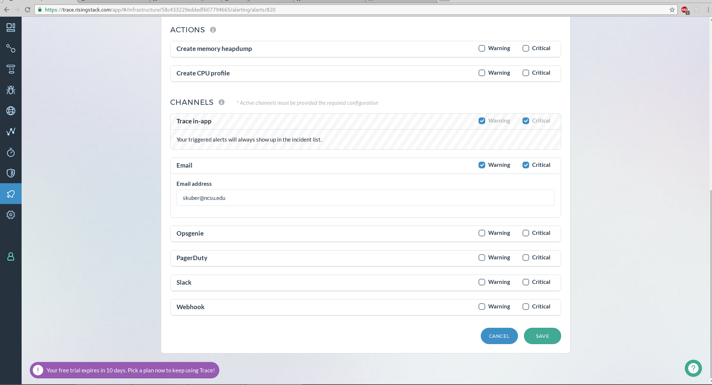
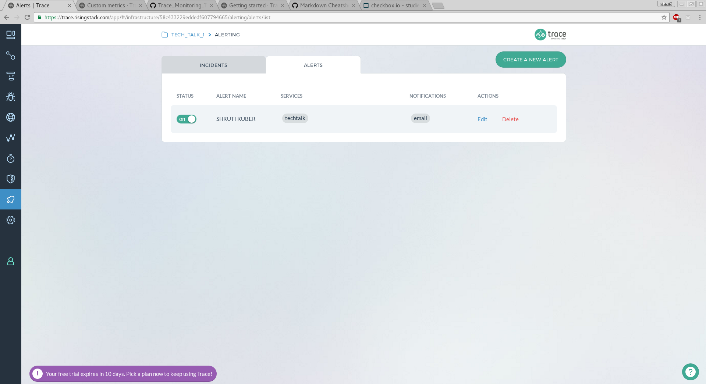
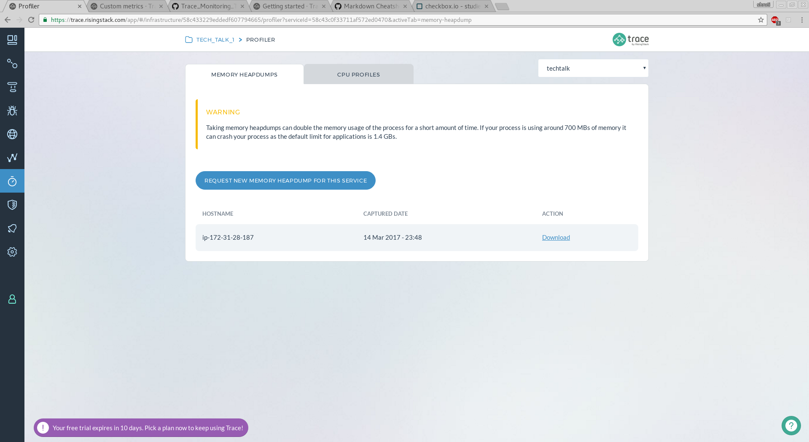
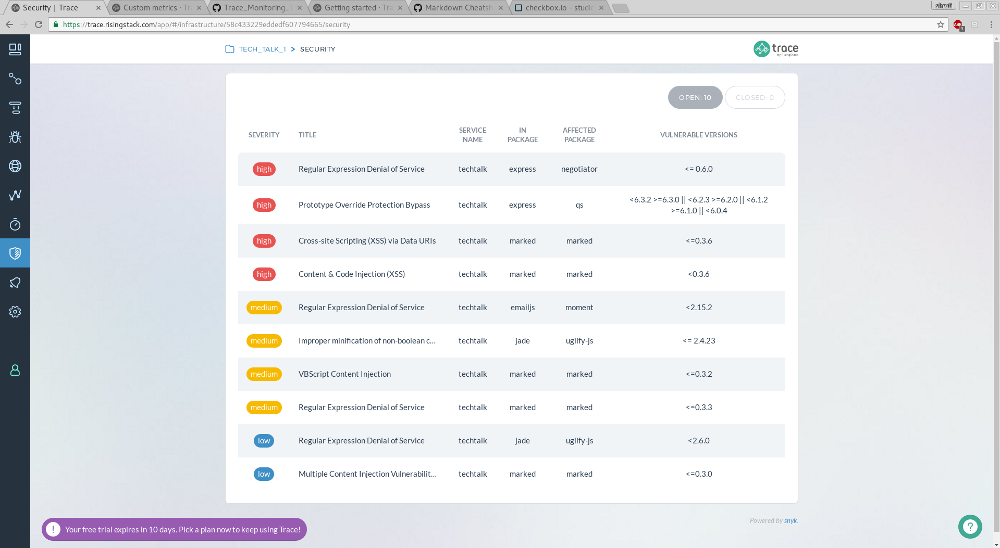

# Monitoring Tool: Trace

## Team Members
* Shruti Kuber
* Raunaq Saxena
* Deepak Nair
* Phaniprakash

## About the Tool

Trace is an open source performance monitoring and error detection tool used for Nodejs applications. It is best suited for microservices based architectures. Taking inspiration from Google Dapper, trace addresses common issues developers face when scaling out their microservices — transaction tracking, monitoring, alerts, and infrastructure visualization. The visualization tools provided by Trace help developers to easily identify the issues in the application and the parts of the application they are arrising from.

## Features

#### Topology View
One of the most important features of this tool, this view helps us to visualize the different services in the application and how they communicate with each other. These services can be databases and 3rd party API's. Each service can be individually monitored and their throughput and response times can be recorded.



#### Trace View
This view gathers information of the various transaction requests in the application and all the transactions with errors are displayed on this view. It helps to easily spot what the errors were in a transaction, where they occurred, check the timings (*) and what other services it affected.


#### Metrics View
This view displays the real-time information of the application. It allows the users to keep track of what is happening in the application. The various metrics that are reporting are: Resposne Time, Throughput, Memory Usage, CPU Utlization and many more. It also allows to set Custom Metrics by observing particular services or API's of interest.





#### Alerts

This view is built on top of the Metrics View. It allows you to create alerts and monitor various metrics and send out alerts if they reach a certain threshold level. Trace provides integrations with various channels to send the alerts: Slack, OpsGenie, Webhooks and Email. It also provides the ability to create memory heapdumps and CPU profiles. Various useful alerts for events like downtime, excess memory usage can be created.




#### Profiler
The profiler allows you to create Memory snapshots and CPU Profiles which can help you to debug the application. Heapdumps help you investigate how your applications allocate memory. You can compare them to find memory leaks.CPU profiles help you find out which function calls takes how much time.Once the Trace agents running on your services receives the request, it profiles the application for 10 seconds.



#### Errors View
This view helps you find and filter errors in your code and see their stack traces and occurrence data.


#### Security
This feature is one of the most important features of Trace. It displays the known vulnerabilities that your services have and also provides suggestions on how to overcome these problems. It also goes through the installed npm packages to check for vulnerabilities and suggests if you can use an updated version. The issues are automatically closed when you have fixed them by either updating a package to a non-vulnerable version, applying a snyk patch, or removing the package completely.




## Our Take on the Tool

* The tool is easy to setup and start using.
* The visualization tools provide an easy way to locate errors and delays caused by different parts of the application.
* The topology tool helps to visualize the communication links between differnt services of the application and their respective throughputs and resposne time.
* The Security view gives you a regular updates on security vulnerabilities in the code and packages if any along with suggestions on how to solve the problem.
* Easy integration with different channels like Slack and OpsGenie for reporting alerts.

## Setup and Configuration

Trace is very easy to setup. Following steps should be followed to setup Trace with your Node.js application:

1. Go to the Trace website https://trace.risingstack.com/app/ and create a new Infrastructure for your application.
2. Create a service within this infrastructure to associate with your app server.
3. Install the Trace collector as a dependency of your Node.js app using the following command:<br/>
      `npm install @risingstack/trace --save`

4. Import Trace in your application code (The file that will be run to start the server). Best if it's included before anything else, as it instruments your other dependencies. Instrumentations for dependencies required before Trace might not work properly.<br/>
```
// index.js

require('@risingstack/trace') // trace should be on top

// your application code
```
5. Create a trace config file to connect to the trace servers using the API key provided to you when you create a new infrastructure for your application on the Trace website. Name this file `trace.config.js`<br/><br/>
  Following is the format of the file:
  
  ````// trace.config.js
module.exports = {
  serviceName: 'test_service',
  apiKey: 'test_API_Key'
};
  ````
6. Run the App (the server.js file in case of checkbox.io) and you can start monitoring your application immediately on the Trace website.

#### Setting Up Custom Metrics
 The above configuration is used for generic monitoring of the complete application. If you want to monitor a specific API or service within your application this can be done with Custom Metrics.  Custom Metrics can be set up in the following way:
 
 * **Record Metrics:** Record metrics is useful when you have multiple events that have a discrete value at a given point of time. With record metrics, you can see more precise values at any given time. With record metrics, you can build a histogram with the reported values.<br/>

Following code can be added to record metrics:<br/>
```
trace.recordMetric('name/of/service', value)
`````

* **Incremental Metrics:** By using increment metrics you don't have to keep track of a value over time as you would in record metric, you simply have to call a function and everything will be done automatically. This comes handy when you would like to keep track of occurrences of events.<br/>

Following code can be added to use incremental metrics:<br/>

````
trace.incrementMetric('name/of/service')
`````

### Screencast
[Demo](https://youtu.be/Xv_XUjq8Pq4)

### Presentation
[Slides](https://youtu.be/Xv_XUjq8Pq4)

### Resources
[Trace Documetation](https://trace-docs.risingstack.com/)

